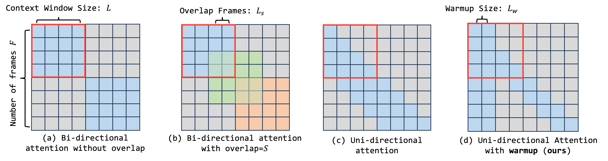
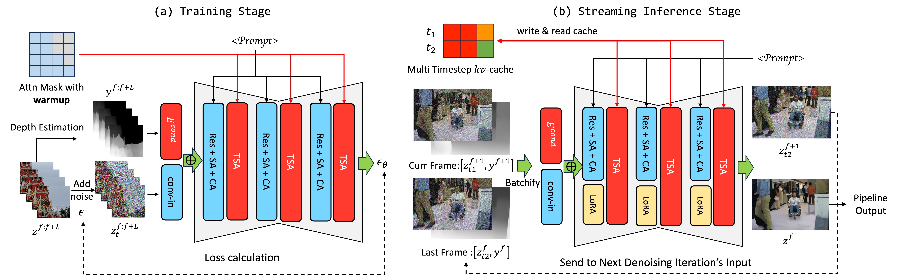

# Live2Diff: **Live** Stream Translation via Uni-directional Attention in Video **Diffusion** Models

<p align="center">
  
</p>

**Authors:** [Zhening Xing](https://github.com/LeoXing1996), [Gereon Fox](https://people.mpi-inf.mpg.de/~gfox/), [Yanhong Zeng](https://zengyh1900.github.io/), [Xingang Pan](https://xingangpan.github.io/), [Mohamed Elgharib](https://people.mpi-inf.mpg.de/~elgharib/), [Christian Theobalt](https://people.mpi-inf.mpg.de/~theobalt/), [Kai Chen †](https://chenkai.site/) (†: corresponding author)


[](https://arxiv.org/abs/2407.08701)
[](https://live2diff.github.io/)
<a target="_blank" href="https://huggingface.co/spaces/Leoxing/Live2Diff">
  
</a>
[](https://huggingface.co/Leoxing/Live2Diff)

## Introduction Video

[](https://youtu.be/4w2cLRW3RX0)

## Release

* [2024/07/18] We release [HuggingFace space](https://huggingface.co/spaces/Leoxing/Live2Diff), code, and [checkpoints](https://huggingface.co/Leoxing/Live2Diff).

## TODO List

- [ ] Support Colab

## Key Features

<p align="center">
  
</p>

* **Uni-directional** Temporal Attention with **Warmup** Mechanism
* **Multitimestep KV-Cache** for Temporal Attention during Inference
* **Depth Prior** for Better Structure Consistency
* Compatible with **DreamBooth and LoRA** for Various Styles
* **TensorRT** Supported

The speed evaluation is conducted on **Ubuntu 20.04.6 LTS** and **Pytorch 2.2.2** with **RTX 4090 GPU** and **Intel(R) Xeon(R) Platinum 8352V CPU**. Denoising steps are set as 2.

| Resolution | TensorRT |    FPS    |
| :--------: | :------: | :-------: |
| 512 x 512  |  **On**  | **16.43** |
| 512 x 512  |   Off    |   6.91    |
| 768 x 512  |  **On**  | **12.15** |
| 768 x 512  |   Off    |   6.29    |

## Installation

### Step0: clone this repository and submodule

```bash
git clone https://github.com/open-mmlab/Live2Diff.git
# or vis ssh
git clone git@github.com:open-mmlab/Live2Diff.git

cd Live2Diff
git submodule update --init --recursive
```

### Step1: Make Environment

Create virtual envrionment via conda:

```bash
conda create -n live2diff python=3.10
conda activate live2diff
```

### Step2: Install PyTorch and xformers

Select the appropriate version for your system.

```bash
# CUDA 11.8
pip install torch torchvision xformers --index-url https://download.pytorch.org/whl/cu118
# CUDA 12.1
pip install torch torchvision xformers --index-url https://download.pytorch.org/whl/cu121
```

Please may refers to https://pytorch.org/ for more detail.

### Step3: Install Project

If you want to use TensorRT acceleration (we recommend it), you can install it by the following command.

```bash
# for cuda 11.x
pip install ."[tensorrt_cu11]"
# for cuda 12.x
pip install ."[tensorrt_cu12]"
```

Otherwise, you can install it via

```bash
pip install .
```

If you want to install it with development mode (a.k.a. "Editable Installs"), you can add `-e` option.

```bash
# for cuda 11.x
pip install -e ."[tensorrt_cu11]"
# for cuda 12.x
pip install -e ."[tensorrt_cu12]"
# or
pip install -e .
```

### Step4: Download Checkpoints and Demo Data

1. Download StableDiffusion-v1-5

```bash
huggingface-cli download runwayml/stable-diffusion-v1-5 --local-dir ./models/Model/stable-diffusion-v1-5
```

2. Download Checkpoint from [HuggingFace](https://huggingface.co/Leoxing/Live2Diff) and put it under `models` folder.

3. Download Depth Detector from MiDaS's official [release](https://github.com/isl-org/MiDaS/releases/download/v3/dpt_hybrid_384.pt) and put it under `models` folder.

4. Apply the download token from [civitAI](https://education.civitai.com/civitais-guide-to-downloading-via-api/) and then download Dreambooths and LoRAs via the script:

```bash
# download all DreamBooth/Lora
bash scripts/download.sh all YOUR_TOKEN
# or download the one you want to use
bash scripts/download.sh disney YOUR_TOKEN
```

5. Download demo data from [OneDrive](https://pjlab-my.sharepoint.cn/:f:/g/personal/xingzhening_pjlab_org_cn/EpefezlxFXNBk93RDttYLMUBP2bofb6AZDfyRIkGapmIrQ?e=A6h2Eb).

Then then data structure of `models` folder should be like this:

```bash
./
|-- models
|   |-- LoRA
|   |   |-- MoXinV1.safetensors
|   |   `-- ...
|   |-- Model
|   |   |-- 3Guofeng3_v34.safetensors
|   |   |-- ...
|   |   `-- stable-diffusion-v1-5
|   |-- live2diff.ckpt
|   `-- dpt_hybrid_384.pt
`--data
   |-- 1.mp4
   |-- 2.mp4
   |-- 3.mp4
   `-- 4.mp4
```

### Notification

The above installation steps (e.g. [download script](#step4-download-checkpoints-and-demo-data)) are for Linux users and not well tested on Windows. If you face any difficulties, please feel free to open an issue 🤗.

## Quick Start

You can try examples under [`data`](./data) directory. For example,
```bash
# with TensorRT acceleration, please pay patience for the first time, may take more than 20 minutes
python test.py ./data/1.mp4 ./configs/disneyPixar.yaml --max-frames -1 --prompt "1man is talking" --output work_dirs/1-disneyPixar.mp4 --height 512 --width 512 --acceleration tensorrt

# without TensorRT acceleration
python test.py ./data/2.mp4 ./configs/disneyPixar.yaml --max-frames -1 --prompt "1man is talking" --output work_dirs/1-disneyPixar.mp4 --height 512 --width 512 --acceleration none
```

You can adjust denoising strength via `--num-inference-steps`, `--strength`, and `--t-index-list`.  Please refers to `test.py` for more detail.

## Troubleshooting

1. If you face Cuda Out-of-memory error with TensorRT, please try to reduce `t-index-list` or `strength`. When inference with TensorRT, we maintian a group of buffer for kv-cache, which consumes more memory. Reduce `t-index-list` or `strength` can reduce the size of kv-cache and save more GPU memory.

## Real-Time Video2Video Demo

There is an interactive txt2img demo in [`demo`](./demo) directory!

Please refers to [`demo/README.md`](./demo/README.md) for more details.

<div align="center">
    <table align="center">
        <tbody>
        <tr align="center">
            <td>
                <p> Human Face (Web Camera Input) </p>
            </td>
            <td>
                <p> Anime Character (Screen Video Input) </p>
            </td>
        </tr>
        <tr align="center">
            <td>
                <video controls autoplay src="https://github.com/user-attachments/assets/c39e4b1f-e336-479a-af72-d07b1e3c6e30" width="100%">
            </td>
            <td>
                <video controls autoplay src="https://github.com/user-attachments/assets/42727f46-b3cf-48ea-971c-9f653bf5a264" width="80%">
            </td>
        </tr>
        </tbody>
    </table>

</div>

## Acknowledgements

The video and image demos in this GitHub repository were generated using [LCM-LoRA](https://huggingface.co/latent-consistency/lcm-lora-sdv1-5). Stream batch in [StreamDiffusion](https://github.com/cumulo-autumn/StreamDiffusion) is used for model acceleration. The design of Video Diffusion Model is adopted from [AnimateDiff](https://github.com/guoyww/AnimateDiff). We use a third-party implementation of [MiDaS](https://github.com/lewiji/MiDaS) implementation which support onnx export. Our online demo is modified from [Real-Time-Latent-Consistency-Model](https://github.com/radames/Real-Time-Latent-Consistency-Model/).

## BibTex

If you find it helpful, please consider citing our work:

```bibtex
@article{xing2024live2diff,
  title={Live2Diff: Live Stream Translation via Uni-directional Attention in Video Diffusion Models},
  author={Zhening Xing and Gereon Fox and Yanhong Zeng and Xingang Pan and Mohamed Elgharib and Christian Theobalt and Kai Chen},
  booktitle={arXiv preprint arxiv:2407.08701},
  year={2024}
}
```
